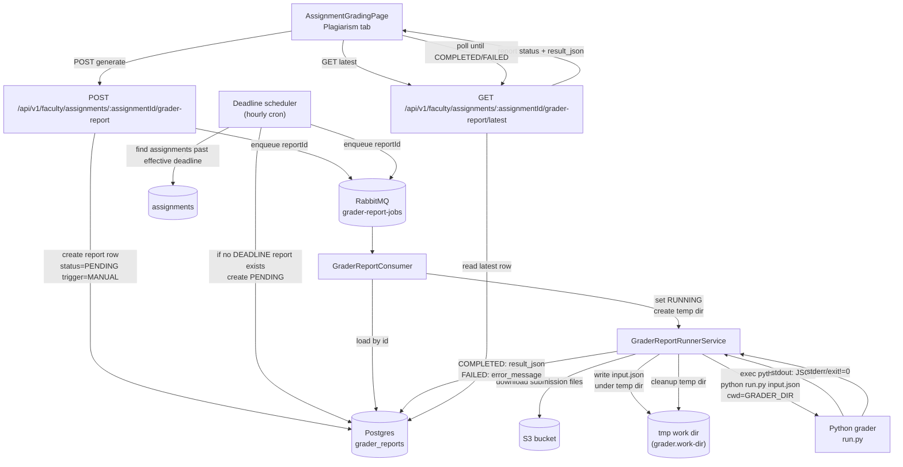

# Grader Report (Similarity/AI) Feature Notes

These are my implementation notes for the **Grader Report** feature. The goal was to support a per-assignment report (similarity/plagiarism now, AI features later) that can be generated:

- **Automatically** after an assignment’s (late) due date passes
- **Manually** when a professor clicks **Generate report**

I intentionally called it “grader report” (not “plagiarism report”) because the JSON payload is meant to grow (similarity + AI + future analyses).

---

## High-level design

- **1 DB row per report** (`grader_reports`): no separate job table.
- **API creates a report row first** (PENDING), then enqueues the report **id**.
- **Queue consumer loads by id**, runs the pipeline, and updates the **same row** to COMPLETED/FAILED with `result_json`/`error_message`.

This keeps the system easy to reason about and makes it safe to retry: the report id is the unit of work.

---

## System diagram (Mermaid)

---

## Backend

### Database + JPA

- **Entity**: `com.grade.forge.graderreport.entity.GraderReport`
  - `assignment`
  - `generatedAt`
  - `triggerType`: `DEADLINE | MANUAL`
  - `status`: `PENDING | RUNNING | COMPLETED | FAILED`
  - `errorMessage`
  - `resultJson` (TEXT)
- **Repo**: latest report lookup + existence checks per assignment/trigger.
- **Index**: `(assignment_id, generated_at DESC)` for fast “latest report” queries.

### Runner (Python invocation)

- Service: `GraderReportRunnerService`
- Flow:
  - creates a temp work dir under `grader.work-dir` (defaults to system temp)
  - downloads submission files from S3 into:
    - `submissions/student_<studentId>/<files...>`
  - writes `input.json`
  - invokes python:
    - `python run.py <absolute-path-to-input.json>`
    - sets working directory to `grader.dir` so imports work
  - reads stdout (JSON) → stores in `grader_reports.result_json`
  - on error → stores message in `grader_reports.error_message`
  - temp folder is deleted at end

Temp dir naming (while running):
- `${java.io.tmpdir}/grader-report-<reportId>-<randomSuffix>/`

### Queue + consumer

- RabbitMQ queue: `grader-report-jobs`
- Message contains: `{ graderReportId }`
- Consumer:
  - loads the `GraderReport` by id
  - ignores if not PENDING (basic dedupe / safety)
  - runs `GraderReportRunnerService.run(report)`

### APIs (faculty)

- **POST** `/api/v1/faculty/assignments/{assignmentId}/grader-report`
  - creates PENDING report (triggerType=MANUAL) and enqueues it
  - returns `202` with the report metadata
- **GET** `/api/v1/faculty/assignments/{assignmentId}/grader-report/latest`
  - returns the latest report (or 404 if none)

`result` is returned as a string (the full JSON) only when status is COMPLETED.

### Deadline scheduler

- Hourly cron (configurable) finds assignments whose **effective deadline** has passed:
  - `lateDueDate` if present, else `dueDate`
- For each assignment, if we don’t already have a DEADLINE-triggered report, create + enqueue one.

Config:
- `grader.report.deadline-schedule.enabled=true|false`
- `grader.report.deadline-schedule.cron=...`

---

## Grader (Python)

Location: repo root `grader/`

- `run.py` is the entry point.
  - reads input path from first CLI arg
  - or env `GRADER_INPUT_PATH`
  - prints the pipeline JSON to **stdout**
  - errors go to **stderr**, exit code `1`

The output JSON includes:
- `assignment_id`
- `results[]` (per student):
  - `student_id`, `final_grade`
  - `similarity_score` (0–1), `similarity_warning`
  - `comparisons[]` for side-by-side viewing (left/right code snippets)
  - `ai_features` object (reserved for future)
- `highlight_markers` (`>>` / `<<`) for frontend highlighting
- top-level `ai_features` (reserved)

---

## Frontend

### Services + types

- `Client/src/services/graderReportService.ts`
  - `requestGraderReport(assignmentId)` → POST
  - `getGraderReportLatest(assignmentId)` → GET (returns `null` on 404)
  - `pollGraderReportUntilDone(...)` → simple polling loop until COMPLETED/FAILED
- `Client/src/types/graderReport.ts`
  - response + parsed JSON shape (so UI can render tables/comparisons)

### UI integration (Assignment grading page)

- `Client/src/app/components/AssignmentGradingPage.tsx`
  - Plagiarism tab now renders `PlagiarismReportPanel`
- `Client/src/app/components/assignment/PlagiarismReportPanel.tsx`
  - loads latest report on mount
  - **Faculty** sees a “Generate report” button (POST + poll)
  - shows:
    - loading / “no report yet”
    - RUNNING/PENDING state
    - FAILED error message
    - COMPLETED table of students + similarity %
    - expandable comparisons showing left/right code blocks

Note: backend endpoints are faculty-only; the UI hides the generate button when not faculty.

---

## Configuration

### Local dev (Spring Boot from `Server/`)

Repo has `grader/` at the root, so from `Server/` the relative path is `../grader`.

- `grader.dir=${GRADER_DIR:../grader}`
- `grader.python-cmd=${GRADER_PYTHON_CMD:python3}`
- `grader.work-dir=${java.io.tmpdir}` (default)

### Docker

I updated the runtime Docker image to include the grader:

- copies `grader/` → `/app/grader`
- installs `pip` deps from `/app/grader/requirements.txt`
- sets env:
  - `GRADER_DIR=/app/grader`
  - `GRADER_PYTHON_CMD=python3`

`docker-compose.yml` now includes a `server` service and mounts `/var/run/docker.sock` so the backend can run its “run tests” feature (which shells out to Docker). If you don’t need run-tests in production, you can remove that mount.

---

## Where output lives

- **Final report output**: stored in DB `grader_reports.result_json` (TEXT)
- **Temporary inputs/files**: written under `${grader.work-dir}` during execution and deleted after the run

